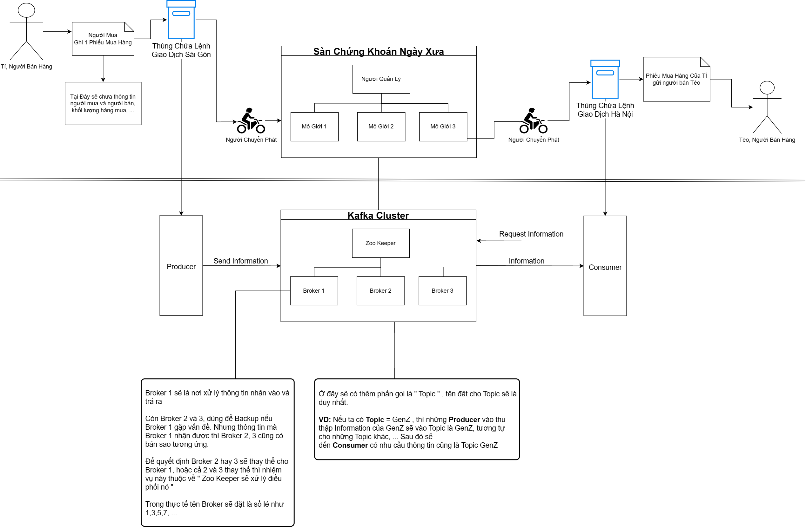

### Basic Mechanism of Kafka


### Setup Kafka on Ubuntu 
* Can use Ubuntu 20.04 LTS for base
* Install Java

```bash
root$ apt update
root$ apt install default-jre
# Check Version after setup
root$ java -version
```

### Download and Install Kafka
```bash
root$ mkdir ~/Downloads
root$ curl "https://downloads.apache.org/kafka/3.7.0/kafka_2.13-3.7.0.tgz" -o ~/Downloads/kafka.tgz
root$ mkdir ~/kafka && cd ~/kafka
root$ tar -xvzf ~/Downloads/kafka.tgz --strip 1

# Edit Kafka config file
nano ~/kafka/config/server.properties
# Add this line in the end of the file, for can delete topic
detete.topic.enable = true
# Also remove comment in this line " listeners=PLAINTEXT://0.0.0.0:9092 "
# And remove comment in this line " advertised.listeners=PLAINTEXT://your.host:9092 "
# Also can check the line have : "log.dirs=/tmp/kafka-logs" and can change the location for save Logs

# 
```
# Setup Zookeeper
```bash
nano /etc/systemd/system/zookeeper.service
```
# Use this Content for Setup Zookeeper
```bash
[Unit]
Requires=network.target remote-fs.target
After=network.target remote-fs.target

[Service]
Type=simple
User=kafka
ExecStart=/home/kafka/kafka/bin/zookeeper-server-start.sh /home/kafka/kafka/config/zookeeper.properties
ExecStop=/home/kafka/kafka/bin/zookeeper-server-stop.sh
Restart=on-abnormal

[Install]
WantedBy=multi-user.target
```
